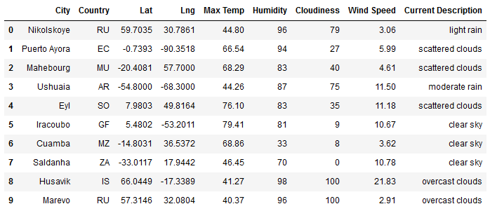
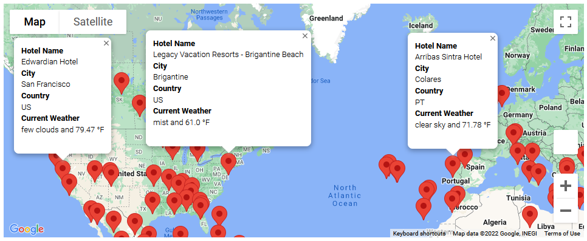
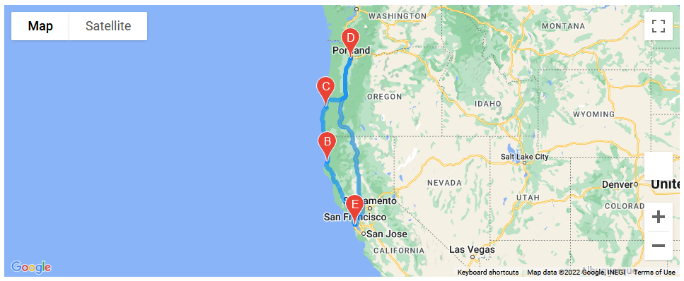
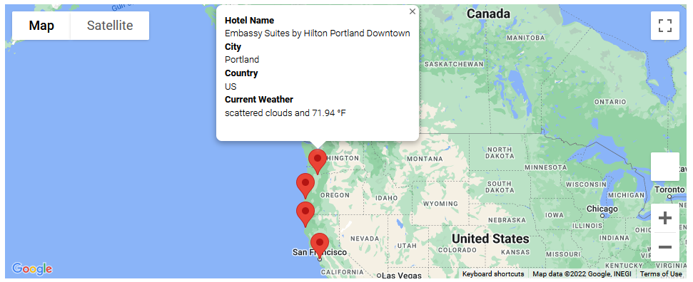

# World Weather Analysis with APIs

## Purpose 

We are creating a PlanMyTrip app with Jack that helps users determine where they should vacation. In the first step we will be gathering weather data for many randomly selected cities, as shown in the table. Next we are plotting the cities with Google gmaps, which will allow for some useful information to be shown when a marker is selected, as shown in the second image. Finally, the last two images show that four cities are selected and a route is created between them, with relevant information being shown in their markers. 

